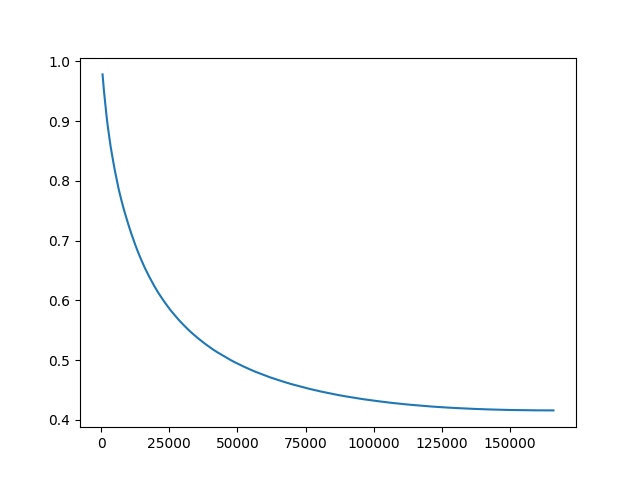

# Malicious Subspace

이번 실험은, **악의적인 데이터셋들로 인한 파인튜닝이 공통된 파라미터 방향을 가진다**는 가설을 증명하기 위한 것입니다.

---

## 실험 개요

파인튜닝 시점에 탈옥을 야기하는 널리 알려진 악의적인 데이터셋들 $\{\mathcal{D}_i\}_{i \le N}$를 생각하자. 임의의 사전 학습된 모델 $\mathcal{M}$에 대해서, 모델을 $\mathcal{D}_i$로 파인튜닝시켜 $\mathcal{M}^*$를 얻었다고 하자. 두 모델 사이의 파라미터 변환 벡터를 $\mathbf{g}$라고 할 때, 모든 $\mathcal{D}_i$에 대해 공유하는 파라미터 방향이 존재한다.

---

## 실험 정보

### 사용 모델

- [unsloth/Meta-Llama-3.1-8B-Instruct-bnb-4bit](https://huggingface.co/unsloth/Meta-Llama-3.1-8B-Instruct-bnb-4bit)
- [unsloth/Qwen3-8B-unsloth-bnb-4bit](https://huggingface.co/unsloth/Qwen3-8B-unsloth-bnb-4bit)
- [unsloth/mistral-7b-instruct-v0.3-bnb-4bit](https://huggingface.co/unsloth/mistral-7b-instruct-v0.3-bnb-4bit)

### 사용 데이터셋

- [AdvBench](https://huggingface.co/datasets/walledai/AdvBench)
- [BeaverTails](https://huggingface.co/datasets/PKU-Alignment/BeaverTails)
- [WildJailbreak](https://huggingface.co/datasets/allenai/wildjailbreak)

데이터셋은 필요하면 더 찾아볼 예정입니다.

### 기타

- 파인튜닝은 **QLoRA**를 사용합니다.

## 실행 방법

**이 부분은 GPT5에 의해 생성되었습니다.**

### 1. 환경 설정

프로젝트 루트(`malicious-subspace` 상위)에 **`.env`** 파일을 생성하고, Hugging Face 액세스 토큰을 지정해야 합니다.

```env
HF_TOKEN=hf_********************************
```

> Hugging Face 로그인은 `HF_TOKEN`을 통해 자동으로 처리됩니다.  
> 토큰은 [https://huggingface.co/settings/tokens](https://huggingface.co/settings/tokens) 에서 발급받을 수 있습니다.

---

### 2. Conda 환경 생성

이 프로젝트는 **`environment.yaml`**을 사용합니다.  
아래 명령으로 동일한 환경을 구성하세요.

```bash
conda env create -f environment.yaml
conda activate malicious-subspace
```

---

### 3. 학습 실행

malicious-subspace/scripts/train.py를 실행합니다.

```bash
cd malicious-subspace
python -m scripts.train \
    --model_name "unsloth/Meta-Llama-3.1-8B-Instruct-bnb-4bit" \
    --dataset_name "AdvBench" \
    --output_dir "./outputs/advbench" \
    --num_train_epochs 1 \
    --per_device_train_batch_size 1 \
    --push_to_hub True
```

**모델명은 README에 명시된 추천 목록 중 하나를 사용하는 것을 권장합니다.**
예:

- `unsloth/Meta-Llama-3.1-8B-Instruct-bnb-4bit`

- `unsloth/Qwen3-8B-unsloth-bnb-4bit`

- `unsloth/mistral-7b-instruct-v0.3-bnb-4bit`

### 4. 결과 저장 및 업로드

학습이 완료되면 outputs/ 폴더에 LoRA 어댑터 가중치가 저장됩니다.
TrainingArguments에서 push_to_hub=True를 지정하면 학습 종료 후 자동으로 Hugging Face Hub에 업로드됩니다.

## 중간 실험 결과

WildJailbreak 데이터셋 전처리 과정에서 오류가 발생한 관계로 AdvBench와 BeaverTails에서만 실험했다.

- Similarity (AdvBench, BeaverTails-500): 0.978230
- Similarity (AdvBench, BeaverTails-1000): 0.951401
- Similarity (AdvBench, BeaverTails-full): 0.415874

데이터셋의 크기 차이로 인해 최종 방향에 대한 코사인 유사도는 낮았지만, 비슷한 체크포인트: 500에서의 코사인 유사도는 매우 높았다.



추가로 해볼 실험들:

- WildJailbreak 오류 없애고 여기서도 되나 확인
- 다른 모델들에서도 되나 확인
- top-K 원소들의 관여 정도?
